# Backstage Template Builder

> **A Backstage plugin for visual template authoring**

[](https://backstage.io)
[](https://opensource.org/licenses/MIT)

Visual authoring for Backstage scaffolder templates

## What this is

Backstage scaffolder templates are powerful, but difficult to author, review, and evolve over time.

Backstage Template Builder is a **Backstage frontend plugin** that provides a visual editor, execution flow view, and live YAML output for creating and maintaining scaffolder templates — without hiding the underlying configuration.

This plugin is designed for platform teams who want faster, safer iteration on templates while staying fully compatible with Backstage's native scaffolder.

## Key features

- **Visual template editor** — Create and edit scaffolder templates using structured forms instead of hand-editing YAML
- **Live YAML view** — Always see the generated YAML side-by-side to retain transparency and control
- **Execution flow visualization** — Understand how scaffolder steps execute through a clear, step-by-step flow view
- **Action discovery** — Browse and add common scaffolder actions (fetch, publish, catalog, custom actions)
- **Preview experience** — See what the end-user form will look like before publishing the template
- **GitHub integration** — Load templates from GitHub repos and push changes back

## Why this exists

Most Backstage adoption challenges don't come from running templates — they come from authoring and maintaining them.

This plugin focuses on:
- Reducing YAML friction
- Making template behavior understandable
- Helping teams treat templates as long-lived products, not one-off files

## Who it's for

- Platform engineering teams
- Backstage administrators
- Architects and PMs defining golden paths
- Anyone responsible for maintaining scaffolder templates at scale

## Quick Look

**Create a new template**
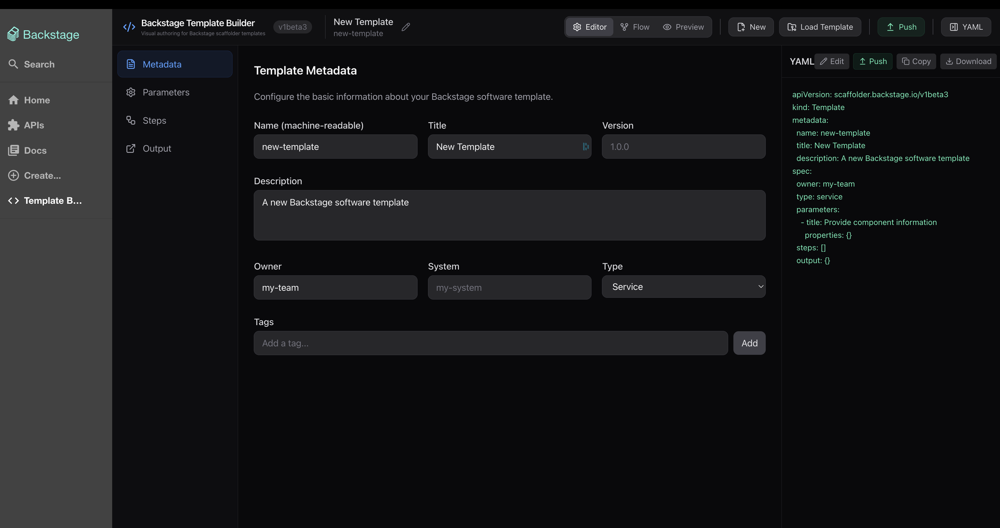

**Load existing templates from GitHub**
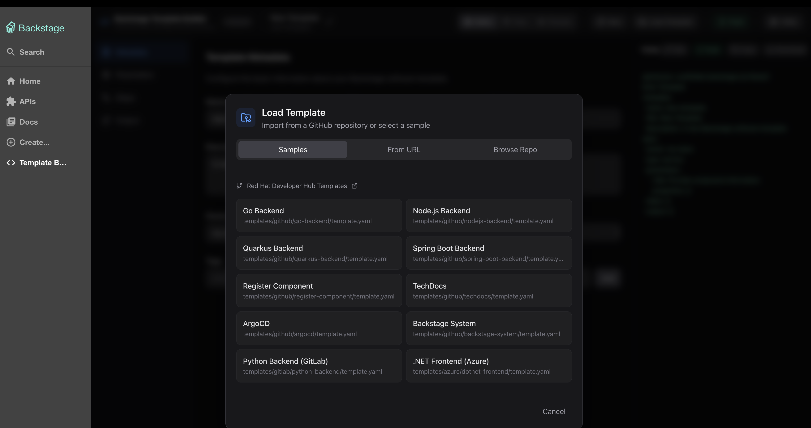

## Installation

### Prerequisites

- An existing Backstage instance (v1.x or higher)
- Node.js 18+ and Yarn

### Quick Start

1. **Copy the plugin to your Backstage monorepo:**

   ```bash
   cp -r plugins/backstage-template-builder <your-backstage-repo>/plugins/
   ```

2. **Add the plugin to your app's dependencies:**

   In `packages/app/package.json`:
   ```json
   {
     "dependencies": {
       "@internal/plugin-backstage-template-builder": "^0.1.0"
     }
   }
   ```

3. **Install dependencies:**

   ```bash
   cd <your-backstage-repo>
   yarn install
   ```

4. **Add the route to your app:**

   In `packages/app/src/App.tsx`:
   ```tsx
   import { TemplateBuilderPage } from '@internal/plugin-backstage-template-builder';

   // Inside <FlatRoutes>
   <Route path="/template-builder" element={<TemplateBuilderPage />} />
   ```

5. **Add to the sidebar (optional):**

   In `packages/app/src/components/Root/Root.tsx`:
   ```tsx
   import CodeIcon from '@material-ui/icons/Code';

   // Inside the menu section
   <SidebarItem icon={CodeIcon} to="/template-builder" text="Template Builder" />
   ```

6. **Start Backstage:**

   ```bash
   yarn dev
   ```

7. **Access the plugin:**

   Navigate to `http://localhost:3000/template-builder` (or click "Template Builder" in the sidebar)

### Detailed Installation Guide

For more detailed integration instructions, troubleshooting, and configuration options, see:
- [Plugin README](plugins/backstage-template-builder/README.md)
- [Integration Guide](plugins/backstage-template-builder/INTEGRATION.md)

## GitHub Integration

The plugin connects directly to GitHub to load and save templates. Users will need to provide a GitHub Personal Access Token with:

**Classic Token:**
- `repo` scope

**Fine-grained Token:**
- Contents: Read and Write
- Metadata: Read

Tokens are stored in localStorage and persist across sessions.

## Usage

Once installed, users can:

1. **Create new templates** — Click "New" to start with a blank template
2. **Load from GitHub** — Import existing templates from repositories
3. **Edit visually** — Use the tabbed interface to configure:
   - **Metadata** — Name, title, description, tags, owner
   - **Parameters** — Input fields with validation, UI widgets, and conditional logic
   - **Steps** — Scaffolder actions (fetch, publish, debug, custom)
   - **Output** — Links displayed after template execution
4. **Preview YAML** — See live YAML output and edit directly if needed
5. **Visualize flow** — View execution flow as a directed graph
6. **Preview end-user experience** — See what developers will see
7. **Save to GitHub** — Push templates back to repositories

## Development

### Plugin Development

To develop the plugin in isolation:

```bash
cd plugins/backstage-template-builder
yarn install
yarn start
```

This will start the plugin at http://localhost:3000 using Backstage's dev utilities.

### Legacy Standalone App (Development Only)

The repository also contains the original standalone Next.js app used during initial development. This is **not recommended for production use** but can be useful for rapid prototyping:

```bash
# From the repository root
npm install
npm run dev
```

> **Note:** The Backstage plugin is the recommended way to use this tool. The standalone app is maintained only for development purposes.

## Architecture

- **Frontend-only plugin** — No backend services required
- **State management** — React Context + useReducer
- **YAML generation** — js-yaml library
- **Drag-and-drop** — @dnd-kit for parameter and step reordering
- **UI components** — Radix UI primitives with Tailwind CSS
- **GitHub integration** — Direct API calls from the browser (no proxy needed)

## Status

Early release / actively maintained

The plugin is functional and ready for use in Backstage instances. APIs and UI may evolve based on feedback.

Contributions, ideas, and feedback are welcome!

## Screenshots

### Visual Template Editor

Build templates using structured forms across four main sections:

**Metadata** - Define template identity, owner, and tags
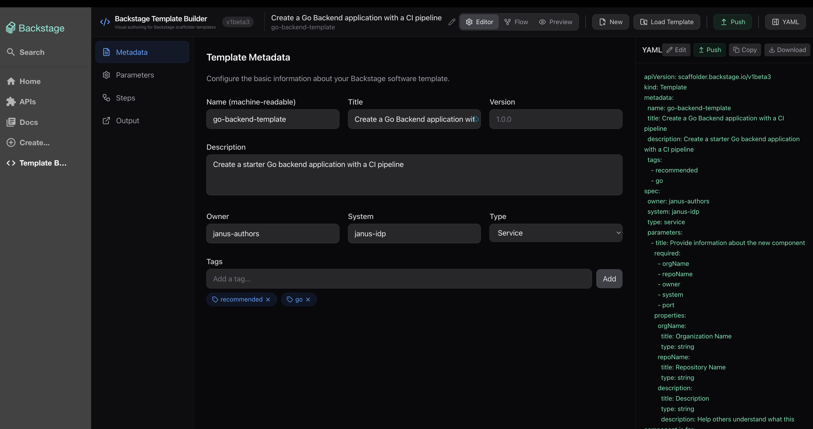

**Parameters** - Create input fields with validation and UI widgets
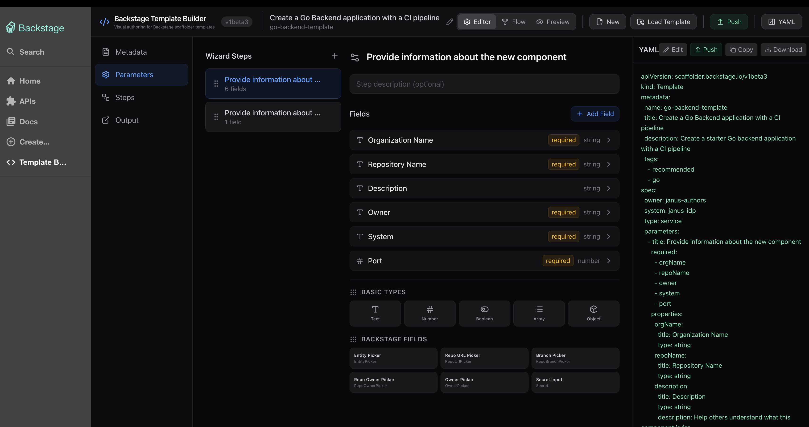

**Steps** - Configure scaffolder actions with detailed inputs
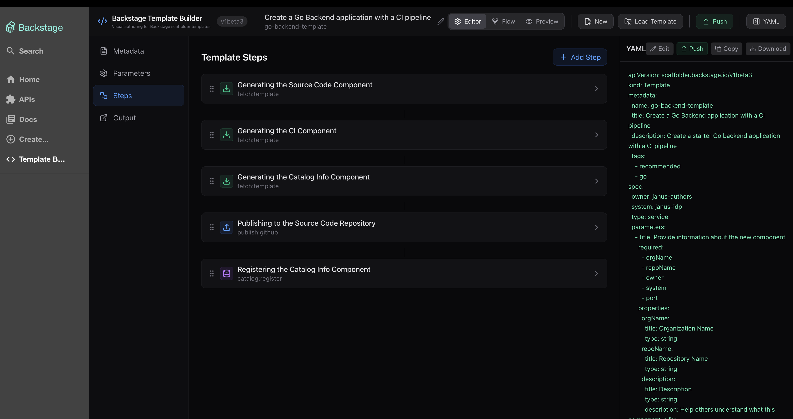

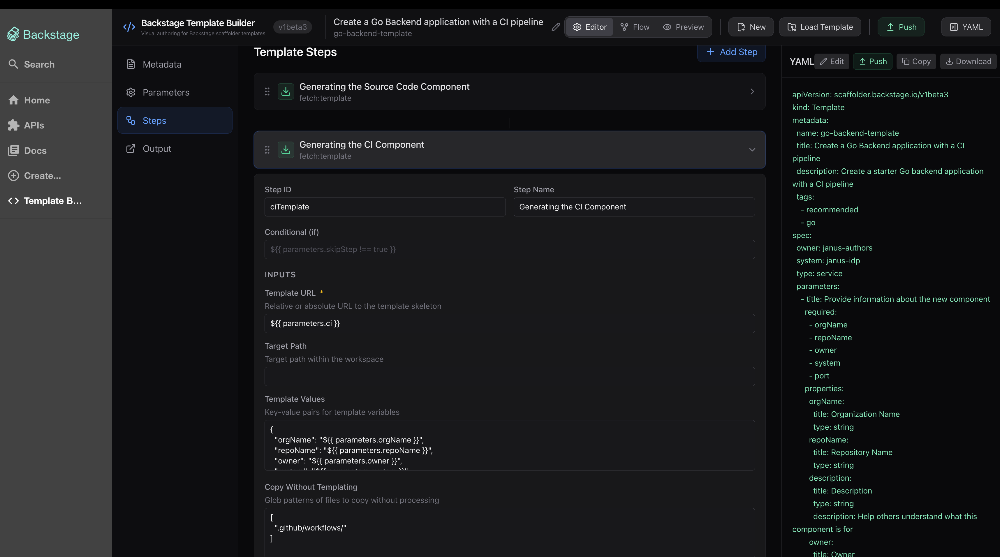

**Output** - Define links shown after template execution
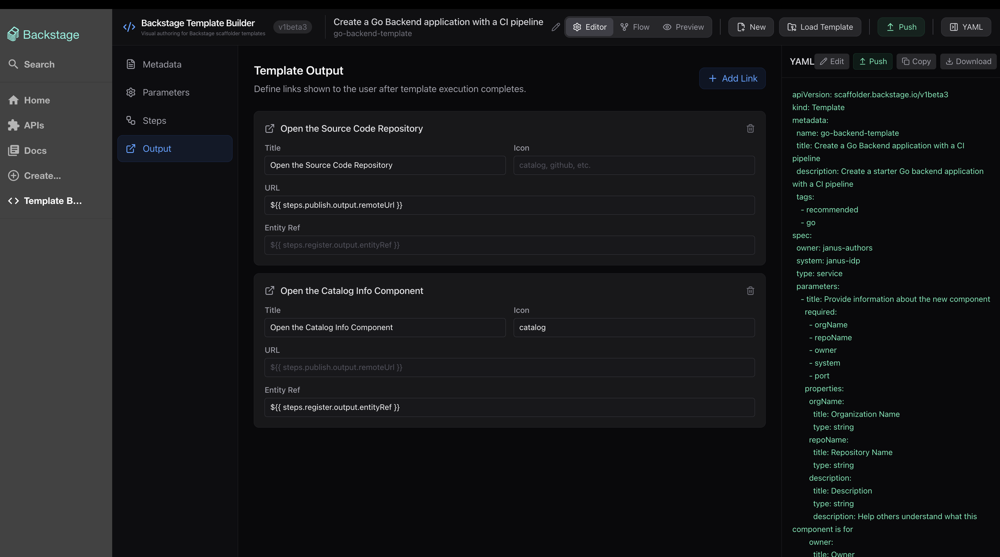

### Execution Flow Visualization

See how your scaffolder steps execute in a visual flow diagram
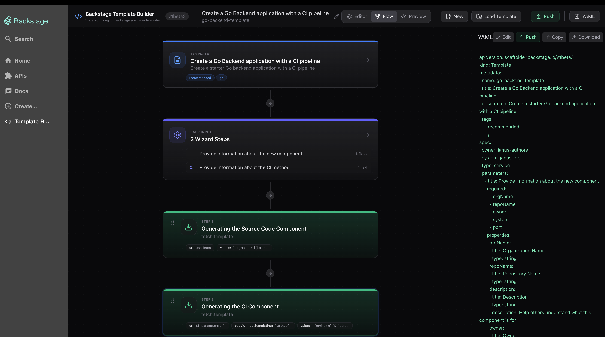

### End-User Preview

Preview what developers will see when using your template

**Form View**
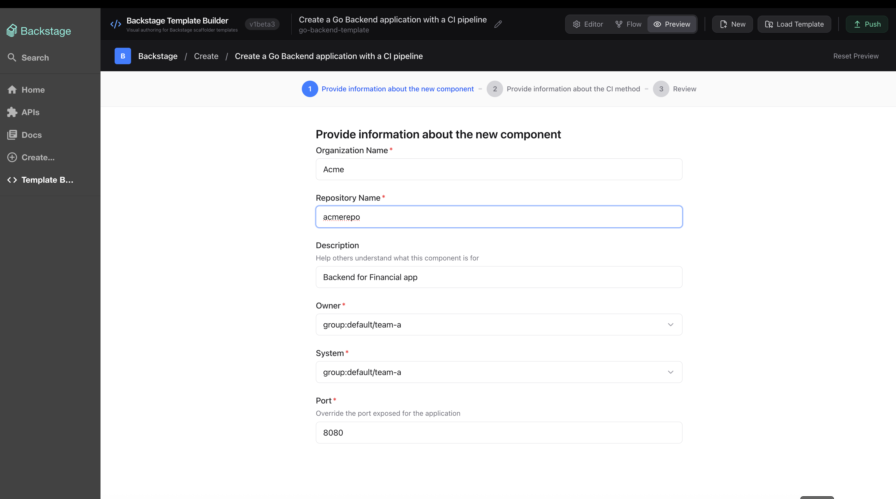

**Review Step**
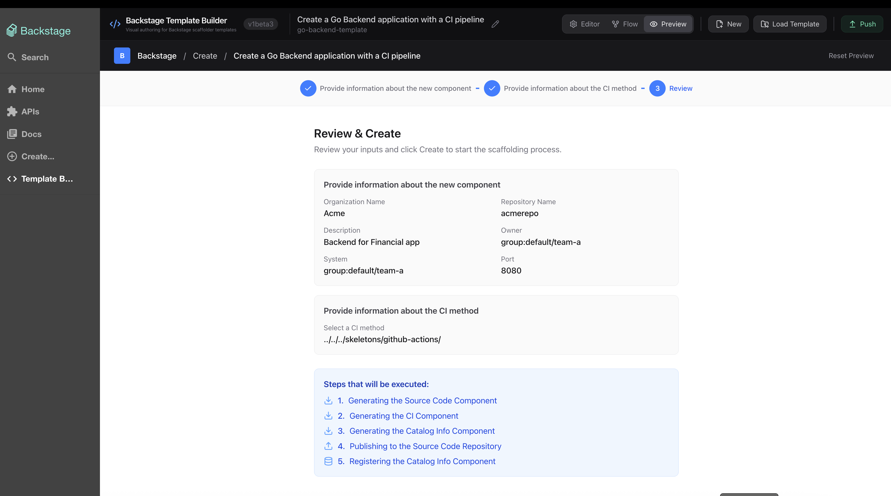

**Completion**
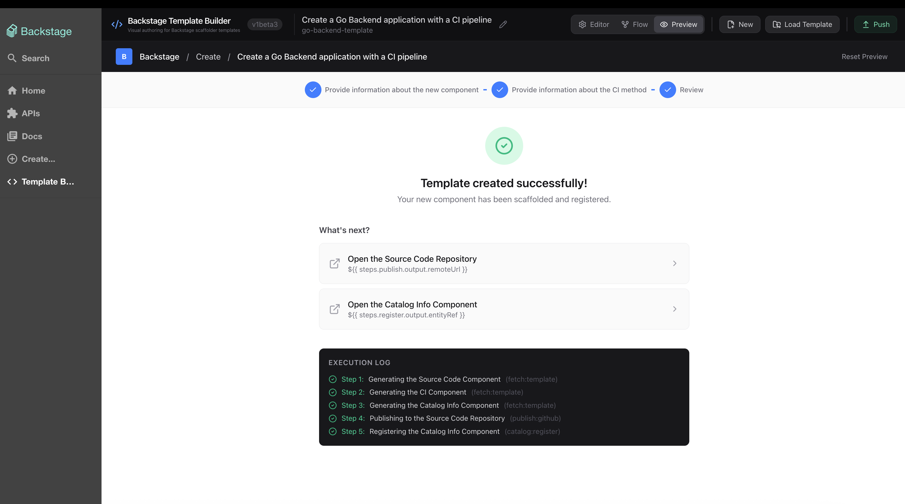

## Roadmap

Potential future enhancements:
- Backend service integration for template validation
- Publish templates directly to Backstage catalog
- Multi-user collaboration features
- Migration to Material-UI for native Backstage styling
- Template versioning and change history
- Permission/RBAC integration

## Contributing

Contributions, ideas, and feedback are welcome!

Please open an issue to discuss larger changes before submitting a PR.

## License

MIT
